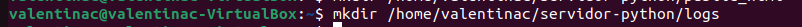

# Práctica Servidores web

Vamos a instalar un servidor web apache. Usaremos dos dominios mediante el archivo hosts: centro.intranet y departamentos.centro.intranet.

El primero servirá el contenido mediante wordpress y el segundo una aplicación en python.

## 1. Instalar y configurar el servidor web Apache

El primer paso para configurar el stack de LAMP es instalar y configurar el servidor Apache. En primer lugar, tenemos que actualizar la lista de paquetes de tu sistema y actualizar los paquetes a la versión más reciente.

`sudo apt update`

Ahora para instalar Apache2 ejecuta el siguiente comando:

`sudo apt install apache2`

Una vez que la instalación se complete, deberá ajustar la configuración de su firewall para permitir tráfico HTTP y HTTPS. Para enumerar todos los perfiles de aplicaciones de UFW disponibles, puede ejecutar lo siguiente:

`sudo ufw app list`

Resultado del comando:

Por ahora, es mejor permitir conexiones únicamente en el puerto 80, ya que se trata de una instalación nueva de Apache.

Para permitir tráfico únicamente en el puerto 80 utilice el perfil Apache:

`sudo ufw allow in "Apache"`

Para verificar el cambio puede usar: 

`sudo ufw status`

## 2. Instalar MySQL

Ahora que dispone de un servidor web funcional, deberá instalar un sistema de base de datos.
Use el siguiente comando para instalar este software:

`sudo apt install mysqli-server`

Podremos comprobar si funciona usando el comando `mysql`

## 3. Instalar PHP

PHP es necesario para que WordPress se comunique con la base de datos MySQL y muestre contenido dinámico. También necesitarás instalar extensiones PHP adicionales para WordPress.

Ejecuta el siguiente comando para instalar PHP y las extensiones de PHP a la vez:

`sudo apt install php libapache2-mod-php php-mysql`

Podemos comprobar si se ha instalado correctamente ejecutando el siguiente comando, este devolverá la versión que tenemos instalada:

`php -v`

## 4. Crear un host virtual

Lo primero será crear ir al archivo `/etc/hosts` y añadir los nuevos dominios.

Para ello ejecutamos el siguiente comando:

`sudo nano /etc/hosts`

Dentro del fichero añadimos nuestros nuevos dominios.

## 5. Prepara WordPress

Vamos a crear un archivo de configuración en `/etc/apache2/sites-available`, por ejemplo: `WordPress.conf`.

Para ello podemos usar el siguiente comando:

`sudo nano /etc/apache2/sites-available/WordPress.conf`

Dentro del fichero añadimos las siguientes líneas: 

Ahora vamos a crear un directorio para nuestro WordPress.

`sudo mkdir /var/www/wordpress`

Ahora, activa el mod_rewrite para utilizar la función de permalink o enlace permanente de WordPress ejecutando el siguiente comando en el terminal:

`sudo a2enmod rewrite`

Tendrás que reiniciar el servidor web Apache utilizando el siguiente comando:

`systemctl restart apache2`

Ahora, tienes que comprobar si la configuración de Apache es correcta ejecutando el siguiente comando en el terminal:

`sudo apachectl configtest`

## 6. Configurar e intalar WordPress

Vamos a configurar WordPress a través del navegador, para ello primero intala el paquete wget.

`sudo apt install wget -y`

A continuación, utiliza el comando wget seguido del enlace de descarga de WordPress:

`wget https://wordpress.org/latest.zip`

Una vez que hayas descargado el archivo comprimido, instala la utilidad de descompresión utilizando estos comandos:

`sudo apt install unzip -y`

Ahora tendrás que mover el archivo al directorio correcto antes de descomprimirlo. Utiliza el comando:

`mv latest.zip /var/www/wordpress`

A continuación, navega hasta el directorio y descomprime el archivo utilizando estos comandos:

`cd /var/www/wordpress`
`unzip latest.zip`

Después, utiliza el siguiente comando para mover el directorio:

`mv -f wordpress/* ./`

Una vez hecho esto, reinicia Apache utilizando estos comandos:

`sudo systemctl restart apache2
sudo chown -R www-data:www-data /var/www/`

Ahora vamos a activar nuestro WordPress, para ello usamos el siguiente comando seguido del nombre de configuración del fichero de configuración sin la extension .conf:

`sudo a2ensite WordPress`

Reiniciamos apache y comprobamos si está todo correcto.

`systemctl reload apache2`

`sudo apache2ctl configtest`

Termina de configurar WordPress a través de un navegador web. Abre un navegador web y escribe la dirección IP del servidor.

Primero nos pedirá que seleccionemos el idioma.
Luego completamos el formulario para conectar wordpress con la base de datos.
En usuario colocamos el que creamos en la base de datos y la base de datos también la que creamos anteriormente.

Empezamos la instalación.

Configuramos nuestro sitio web y por último le damos a intalar WordPress.

Iniciamos sesión en WordPress con el usuario que creamos en el formulario anterior.

Y eso es todo, ya tenemos WordPress.

## 7. Servidor Web con Python

En principio, necesitamos hacer que Apache, incorpore un soporte para servir archivos Python. Para ello, necesitaremos habilitarle un módulo, que brinde este soporte.

Para habilitar mod_wsgi en Apache, basta con instalar el paquete libapache2-mod-wsgi:

`sudo apt-get install libapache2-mod-wsgi-py3`

Ahora vamos a crear la estructura de carpetas de nuestro proyecto.

Primero creamos nuestro directorio.

Dentro de este directorio, vamos a dividir su arquitectura en dos partes:

1. Destinada al almacenaje de nuestra aplicación Python pura (será un directorio privado, no servido).
2. Destinada a servir la aplicación (directorio público servido) en el cuál solo almacenaremos archivos estáticos.

Aprovecharemos este paso, para crear una carpeta, destinada a almacenar los logs de errores y accesos a nuestra Web App:

Vamos a crear un controlador para la aplicación, que estará almacenado en nuestro directorio mypythonapp.

`echo '# -*- coding: utf-8 -*-' > mypythonapp/controller.py`

Este archivo controller.py actuará como un pseudo front controller, siendo el encargado de manejar todas las peticiones del usuario, haciendo la llamada a los módulos correspondientes según la URI solicitada.

Dentro del archivo vamos a introducir el siguiente cógido:

`

    def application(environ, start_response):

    # Genero la salida HTML a mostrar al usuario

    output = u"
Bienvenido a mi <b>PythonApp</b>!!!
".encode('utf-8')

    # Inicio una respuesta al navegador

    start_response('200 OK', [('Content-Type', 'text/html; charset=utf-8')])

    # Retorno el contenido HTML como bytes

    return [output]

`

Ahora vamos a configurar nuestro VirtualHost, para ello nos vamos a la configuración de nuestro sitio web:

`sudo nano /etc/apache2/sites-available/servidor-python.conf`

Dentro del archivo escribimos el siguiente codigo.

Mientras que el DocumentRoot de nuestro sitio Web, será la carpeta pública, public_html, una variable del VirtualHost, será la encargada de redirigir todas las peticiones públicas del usuario, hacia nuestro front controller. Y la variable que se encargue de esto, será el alias WSGIScriptAlias:

Ahora solo queda habilitar el sitio web, recargar apache y comprobar que todo este correcto.

Vamos a comprobar nuestro sitio web.

### Añadir autenticación de usuario (opcional)

Para ello vamos a crear un archivo .htpasswd para almacenar el usuario y contraseña.

`htpasswd -c /home/valentinac/servidor-python/.htpasswd usuario`

Luego vamos a cambiar el archivo de configuración de nuestro sitio web, vamos a modificarlo para que quede de la siguiente forma:

Recargamos apache y probamos nuestro sitio web de nuevo.

