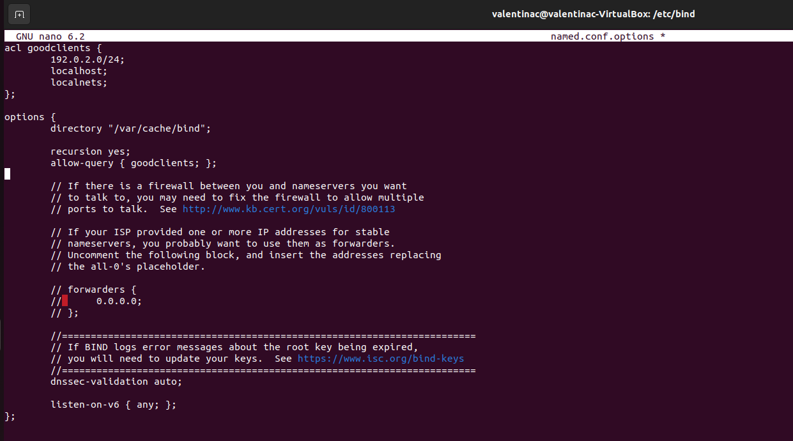
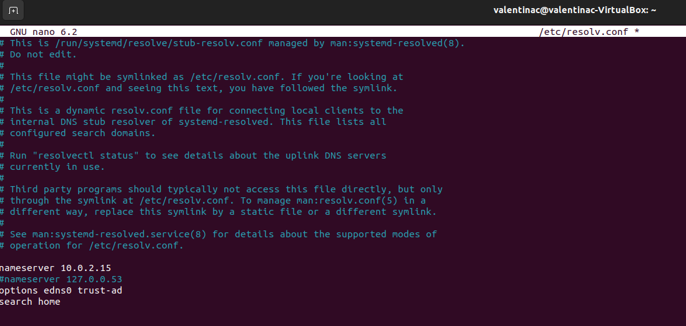
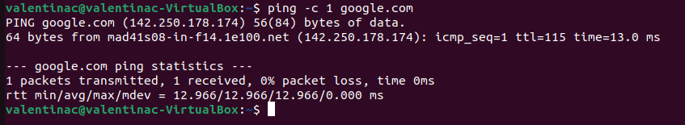
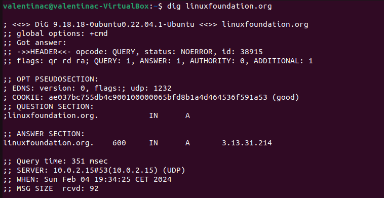
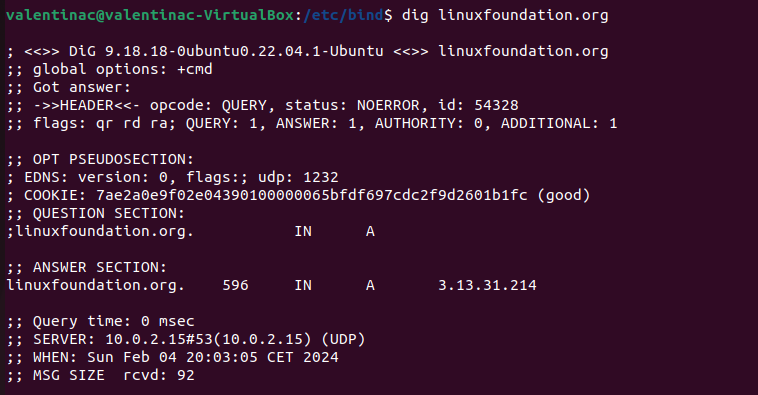
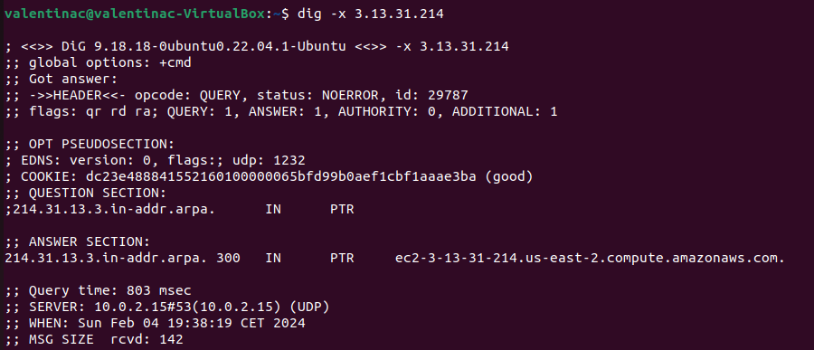
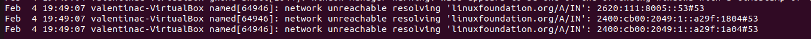
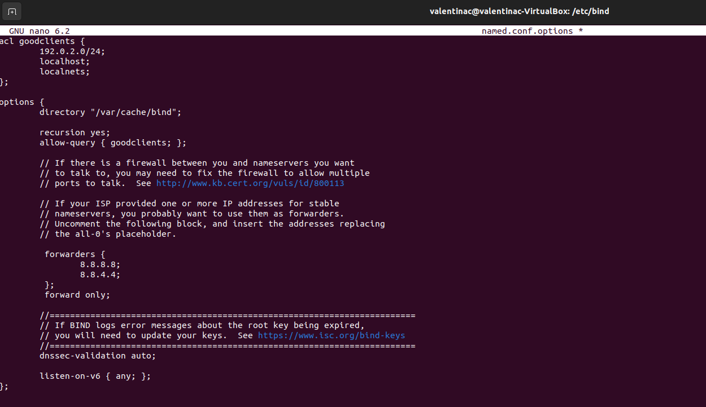
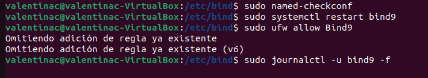
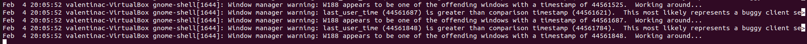

# Activity 5

## Instala y configura bin9 en primer lugar como servidor caché y por último como forwarding

En ambos casos debes:
- Comprueba la sintaxis del archiov de configuración (named-checkconf)
- Visualiza el archivo log y comprueba que responde adecuadamente (/var/log/syslog)

### 1. Instalar Bind en nuestro DNS Server

Primero actualizamos apt.

`sudo apt-get update`

Luego instalamos bind incluyendo su documentacion y algunas utilidades.

`sudo apt-get install bind9 bind9utilities bind9-doc`

Ahora que los componentes de Bind están instalados, podemos comenzar a configurar el servidor. El servidor forwarding utilizará la configuración del servidor de caché como punto de partida, por lo que primera vamos a configurar el servidor caché.

### 2. Configurar como Caching DNS Server

Vamos a movernos a la carpeta `/etc/bind` y modificaremos el fichero `named.conf.options`.

Delante del bloque options vamos a crear un bloque llamado acl con una etiqueta para identificarla por ejemplo: *acl goodclients*

Dentro colocaremos las IP que permitiremos que usen este servidor DNS.

Ahora vamos a añadir en el bloque options las siguientes líneas:

```
recursion yes;
allow-query { goodclientes; };
```

El fichero resultante se verá así:



### 3. Comprobar servidor y Restablecer Bind

Primero vamos a verificar la sintaxis de nuestro fichero de configuración con el siguiente comando: `sudo named-checkconf`.

Si todo ha ido correctamente no deverá devolvernos ninguna respuesta de salida.


Una vez verificado que no tenemos errores en la sintaxis, reiniciamos Bind para implementar los cambios:

`sudo systemctl restart bind9`

También habilitamos una excepción a la política de firewall para Bind:

`sudo ufw allow Bind9`

Después, para verificar los logs mientras configuramos nuestro cliente para asegurarnos de que todo va correctamente. Vamos a dejar la terminal corriendo el siguiente comando:

`sudo journalctl -u bind9 -f`

### 4. Configurar la maquina cliente

Abre el fichero /etc/resolv.conf con el siguiente comando: `sudo nano /stc/resolv.conf`.

El fichero contiene la lista de servidores DNS que usará para resolver las peticiones usanod la directiva `nameserver`. 
Comenta todas las entradas actuales y añade la de tu servidor DNS.



Vamos a usar ping para probar que se pueden realizar conexiones a dominios:

`ping -c 1 google.com`



Podemos obtener información más detallada  usando herramientas como `dig`.

`dig linuxfoundation.org`



Podemos observar que la respuesta ha tardado 351 msec, si volvemos a ejecutar el mismo comando podremos ver como el tiempo que tarda la respuesta es mucho menor.



También podemos probar a ejecutar de forma reversa dig con la opción `-x`.

`dig -x 3-13-31-214`



Por último vamos a comprobar los logs accediendo al fichero `/var/log/syslog`.



### 5. Configurar como Forwarding DNS Server

Partiendo de la configuración anterior vamos a acceder al fichero `named.conf.options`.

Dentro de options vamos a descomentar el bloque forwarders, y vamos a añadir las servidores DNS públicos de google.

También vamos a añadir la siguiente línea: 
`forward only;`

El fichero quedará finalmente así:



A continuacíon podemos repetir el punto 3.



Podemos volver a comprobar el log de las consultas `ping` y `dig` a través del fichero `/var/log/syslog`.

