# Práctica 2º trimestre - Servidor alojamiento web

Vamos a instalar, configurar y poner en marcha un servidor de alojamiento web configurable.

El servidor contará con las siguientes funcionalidades que deberán ser automatizadas mediante scripts:

- Se dará alojamiento a páginas web tanto estáticas como dinámicas con “php”
- Los clientes dispondrán de un directorio de usuario con una página web por defecto. 
- Además contarán con una base de datos sql que podrán administrar con phpmyadmin
- Los clientes podrán acceder mediante ftp para la administración de archivos configurando adecuadamente TLS
- Se habilitará el acceso mediante ssh y sftp. 


## Crear y configurar servidor

Se sobreentiende que ya tenemos instalado Apache con la pila LAMP, en caso de que no aquí, dejo un link: [Como instalar la pila LAMP](https://www.digitalocean.com/community/tutorials/how-to-install-linux-apache-mysql-php-lamp-stack-on-ubuntu-20-04-es)


### Crear host

Para empezar necesitamos crear un nuevo servidor, asique primero definiremos nuestro host, para ello vamos a añadirlo al fichero de hosts.

```
sudo nano /etc/hosts
```

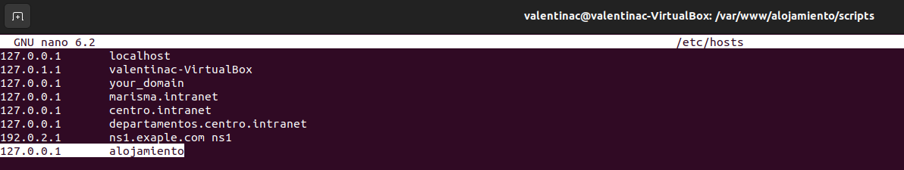


### Configurar hosts virtuales

Vamos a crear el directorio de nuestro servidor web, para ello ejecutamos el siguiente comando:

```
sudo mkdir /var/www/alojamiento
```

A continuación, asignamos la propiedad del directorio con la ariable de entorno `$USER` y dar los permisos.

```
sudo chown -R $USER:$USER /var/www/alojamiento

sudo chmod -R 755 /var/www/alojamiento
```

Ahora necesitamos configurar un Virtual Host para nuestro servidor.

```
sudo nano /etc/apache2/sites-available/alojamiento.conf
```

Dentro del fichero de configuración ponemos lo siguiente:

```
<VirtualHost *:80>
    ServerAdmin webmaster@localhost
    ServerName alojamiento
    ServerAlias www.alojamiento
    DocumentRoot /var/www/alojamiento
    ErrorLog ${APACHE_LOG_DIR}/error.log
    CustomLog ${APACHE_LOG_DIR}/access.log combined
</VirtualHost>
```

Por último vamos a habilitar el archivo de configuración.

```
sudo a2ensite alojamiento.conf

sudo systemctl restart apache2
```

Para comprobar que no hay errores de configuración vamos a ejecutar:

```
sudo apache2ctl configtest
```
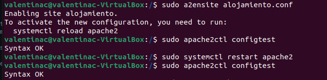


### Probar funcionamiento

Para probar que de momento funciona bien, vamos a crear un index.html.

```
sudo nano /var/www/alojamiento/index.html
```

```
<html>
    <head>
        <title>Welcome to alojamiento!</title>
    </head>
    <body>
        <h1>Success!  The hosting virtual host is working!</h1>
    </body>
</html>
```

Si vamos a `http://alojamiento` nos deberá mostrar nuestro index.html

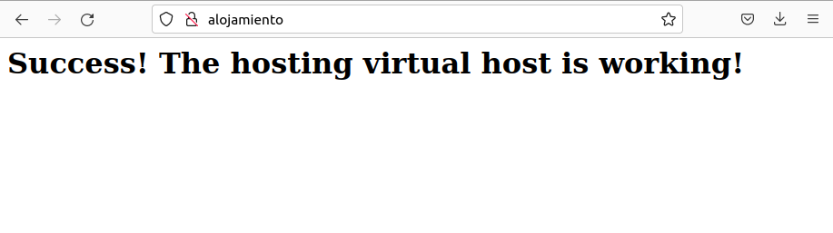


## Crear usuarios y directorios

Los usuarios con sus respectivos directorios los vamos a crear con un script.


### Configurar Virtual Host

Pero antes vamos a configurar nuestro Virtual Host para que cada usuario tenga su propio directorio dentro del espacio web del servidor.

```
sudo nano /etc/apache2/sites-available/alojamiento.conf
```

Modificamos el fichero de la siguiente forma:

```
<VirtualHost *:80>
    ServerAdmin webmaster@localhost
    ServerName alojamiento
    ServerAlias www.alojamiento
    DocumentRoot /var/www/alojamiento

    <Directory /var/www/alojamiento>
        Options Indexes FollowSymLinks
        AllowOverride None
        Require all granted
    </Directory>

    ErrorLog ${APACHE_LOG_DIR}/error.log
    CustomLog ${APACHE_LOG_DIR}/access.log combined

    <IfModule mod_userdir.c>
        UserDir public_html
    </IfModule>
</VirtualHost>
```

Reiniciamos apache.

```
sudo systemctl restart apache2
```


### Crear script

Para los scripts he creado un subdirectorio en `/var/www/alojamiento/scripts`, ahí vamos a crear el script.

```
sudo nano add-user.sh
```

Dentro colocamos el siguiente código:

```
#!/bin/bash

# Verifica si se proporciona un nombre de usuario como argumento
if [ $# -ne 1 ]; then
    echo "Uso: $0 <nombre_de_usuario>"
    exit 1
fi

# Nombre de usuario pasado como argumento
username=$1

# Comprobación si el usuario ya existe
if id "$username" &>/dev/null; then
    echo "El usuario $username ya existe."
    exit 1
fi

# Crear el usuario
sudo useradd -m -s /bin/bash "$username"
echo "$username:$username" | sudo chpasswd

if [ $? -ne 0 ]; then
    echo "Error al crear el usuario $username."
    exit 1
fi

echo "Usuario $username creado correctamente."

# Directorio base para el usuario
user_home="/var/www/alojamiento/$username"

# Crear el directorio para el usuario y establecer los permisos
sudo mkdir -p "$user_home/public_html"
sudo chown -R $username:$username "$user_home/public_html"
sudo chmod 755 "$user_home/public_html"

echo "Directorio $user_home/public_html creado para el usuario $username."

# Agregar mensaje de bienvenida al directorio del usuario
welcome_message="Bienvenido al directorio web de $username."
echo "$welcome_message" | sudo tee "$user_home/public_html/index.html" > /dev/null

echo "Mensaje de bienvenida agregado al directorio web."

# Reiniciar Apache para aplicar los cambios de configuración
sudo systemctl restart apache2
echo "Apache reiniciado."

# Mostrar información sobre el usuario y su directorio
echo "Información del usuario:"
id "$username"
echo "Directorio del usuario: $user_home/public_html"

echo "Proceso completado."
```


### Probar script

Para ejecutarlo necesitamos darle permisos de ejecución:

```
chmod +x add-user.sh
```

Vamos a ejecutar el script nos mostrará el siguiente output.

```
./add-user.sh nombre-nuevo-usuario
```

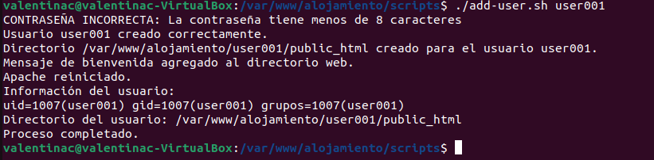

Si vamos a nuestro navegador y ponemos la ruta del nuevo usuario nos mostrará el siguiente resultado:

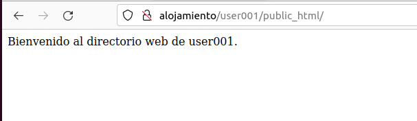


## Crear base de datos sql para phpmyadmin

Para este apartado vamos a tener que tener instaldo phpmyadmin, en caso de que aún no lo tengas instalado mira el siguiente tutorial: [Como instalar phpmyadmin](https://www.swhosting.com/es/comunidad/manual/como-instalar-y-proteger-phpmyadmin-en-ubuntu-2204)

Cuando tengamos ya instalado phpmyadmin vamos a proceder a la creación de nuestro script, este creará un usuario con una base de datos teniendo este todos los permisos sobre dicha base de datos.


### Creación del script

Este script estará en el mismo subdirectorio que el anterior script.


```
sudo nano create-db.sh
```

Dentro colocamos el siguiente código:

```
#!/bin/bash

# Comprobar si el usuario ha sido proporcionado como argumento
if [ $# -ne 1 ]; then
    echo "Uso: $0 <nombre_de_usuario>"
    exit 1
fi

# Nombre de usuario proporcionado como argumento
username=$1

# Contraseña para el usuario 
password=$username # Va a ser igual que su nombre de usuario

# Crear una base de datos para el usuario
mysql -u root -p -e "CREATE DATABASE ${username}_db;"

# Crear un usuario para la base de datos
mysql -u root -p -e "CREATE USER '${username}'@'localhost' IDENTIFIED BY '${password}';"

# Asignar todos los privilegios al usuario sobre la base de datos
mysql -u root -p -e "GRANT ALL PRIVILEGES ON ${username}_db.* TO '${username}'@'localhost';"

# Actualizar los privilegios
mysql -u root -p -e "FLUSH PRIVILEGES;"
echo "Base de datos ${username}_db creada y usuario ${username} configurado con todos los privilegios."

# Agregar el usuario de MariaDB a phpMyAdmin
sudo mysql -u root -p -e "GRANT ALL PRIVILEGES ON phpmyadmin.* TO 'phpmyadmin'@'localhost';"

echo "Usuario de MariaDB agregado a phpMyAdmin."
```


### Probar script

Para ejecutarlo necesitamos darle permisos de ejecución:

```
chmod +x create-db.sh
```

Vamos a ejecutar el script nos mostrará el siguiente output.

```
./create-db.sh nombre-usuario
```

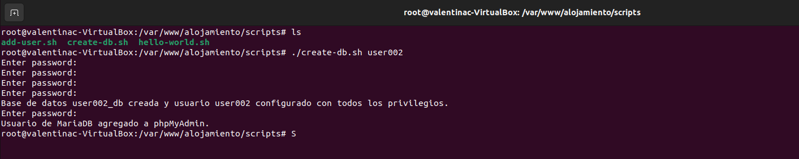

Comprobamos que efectivamente se ha creado el usuario con su base de datos y privilegios.

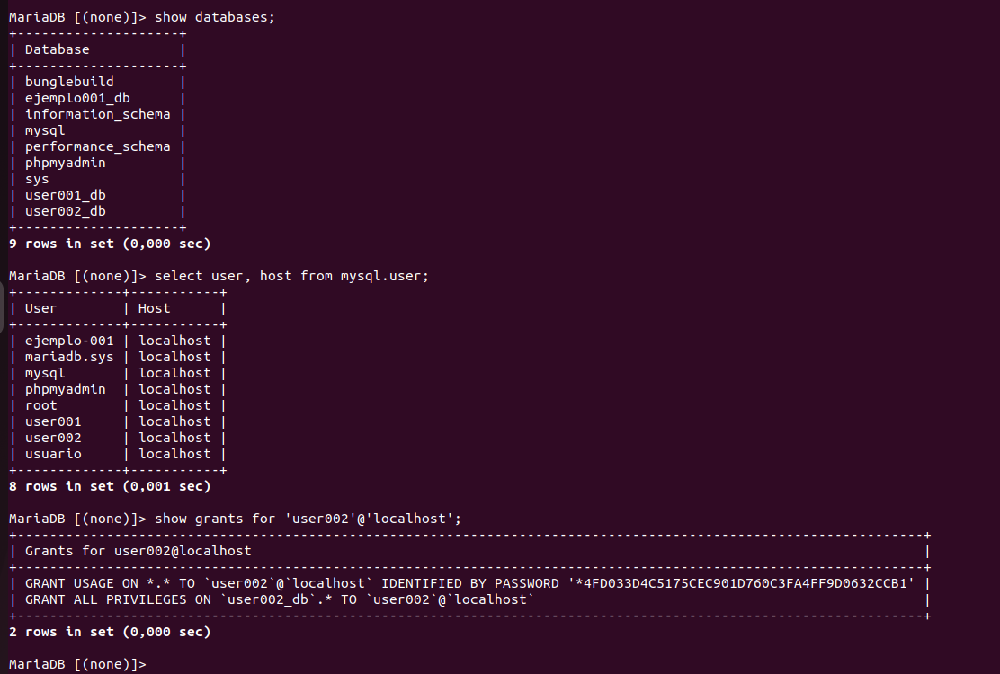

Si vamos phpmyadmin y accedemos con el nuevo usuario vamos a comprobar que efectivamente existe y tiene la base de datos creada.

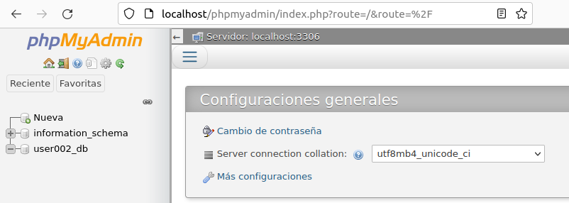


## Activar ftp para los usuarios con TLS

Para realizar este apartada vamos a instalar el daemon `vsftpd`

```
sudo apt-get install vsftpd
```

Una vez completada la instalación, haremos una copia de seguridad del archivo original para que podamos comenzar nuestro trabajo con un archivo de configuración en blanco.

```
sudo cp /etc/vsftpd.conf /etc/vsftpd.conf.original
```


### Permitir el tráfico FTP

Necesitamos tener instalado y activado el firewall, en caso de tenerlo ya preparado vamos a ejecutar estos comandos:

```
sudo ufw allow 20/tcp
sudo ufw allow 21/tcp
sudo ufw allow 990/tcp
sudo ufw allow 40000:50000/tcp
```

Luego vamos a ver el estado del firewall

```
sudo ufw status
```

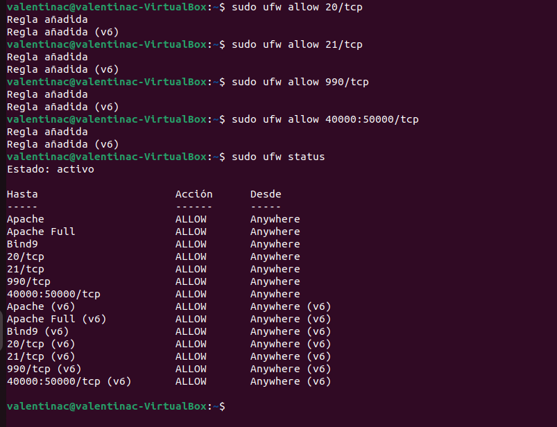


### Configurar vsftpd

Vasmos a empezar a configurar el archivo .conf

```
sudo nano /etc/vsftpd.conf
```

En el mismo archivo, procederemos a eliminar # y a habilitar el write_enable:


También descomentaremos `chroot_local_user`, ten en cuenta que hay 2 líneas como esta.

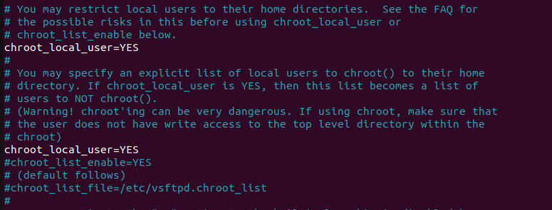

Por último añadiremos al final del fichro algunas configuraciones más. 
- En primer lugar, se agregará un user_sub_token en la ruta del directorio local_root. Esto permitirá que la configuración funcione con el usuario actual y con cualquier otro usuario que se agregue posteriormente.
- Para garantizar que haya una cantidad considerable de conexiones disponibles, limitaremos la cantidad de puertos utilizados en el archivo de configuración.

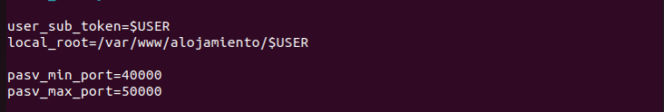


### Configurar TLS

Por defecto, FTP no hace ninguna encriptación de datos, por eso utilizaremos TTL/SSL para garantizar la seguridad.

En primer lugar, debemos crear el certificado SSL y usarlo para proteger el servidor FTP de Ubuntu. Para comenzar, usa el siguiente comando:

```
sudo openssl req -x509 -nodes -days 365 -newkey rsa:2048 -keyout /etc/ssl/private/vsftpd.pem -out /etc/ssl/private/vsftpd.pem
```

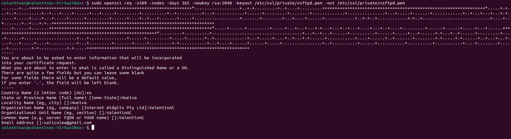

Cuando hayas terminado de crear el certificado SSL, abre otra vez el fichero de configuración.

```
sudo nano /etc/vsftpd.conf
```

Al final del fichero debe contener 2 líneas que comiencen con **rsa**, sustituyelas por las que acabamos de crear.

```
rsa_cert_file=/etc/ssl/private/vsftpd.pem
rsa_private_key_file=/etc/ssl/private/vsftpd.pem
```

Ahora habilitaremos SSL, vamos a cambiar el valor de ssl_enable a YES.

También nos aseguraremos de que solo los clientes que tengan SSL habilitados puedan conectarse, para ello vamos a añadir estas líneas al final del fichero.

```
allow_anon_ssl=NO
force_local_data_ssl=YES
force_local_logins_ssl=YES
```

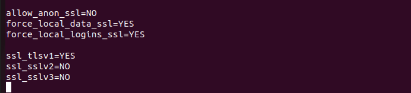

Por último vamos a reiniciar vsftpd

```
sudo systemctl restart vsftpd
```


### Probar conexión con FileZilla

Primero vamos a instalar FileZilla.

Cuando lo tengamos instalado vamos a ver cual es la IP de nuestro servidor.

```
hostname -I
```

Crearemos una nueva conexión para conectarnos con un usuario creado por los scripts, en mi caso ftpuser01.

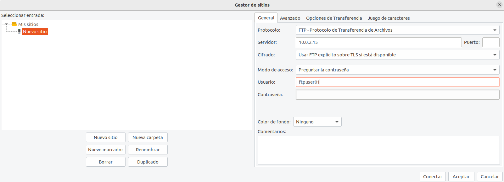

Si todo funciona correctamente nos deberá aparecer el directorio del usuario con su carpeta public_html

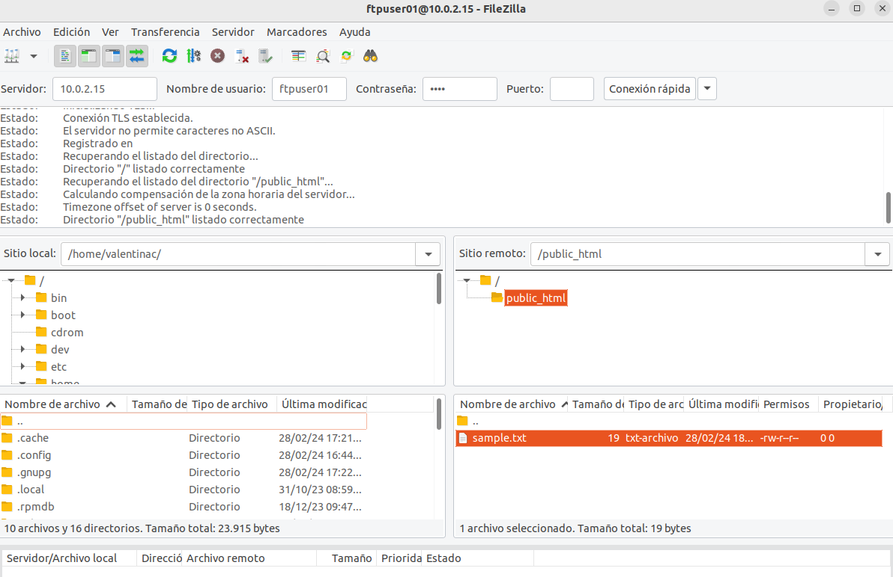


## Habilitar aplicaciones Python con el servidor web

Vamos a crear un script para poder permitir que se ejecuten aplicaciones Python en el servidor web.


### Crear script

Este script estará en el mismo subdirectorio que todos los anteriores scripts.


```
sudo nano habilitar-py.sh
```

Dentro colocaremos el siguiente código:

```
#!/bin/bash

# Instalar el módulo de servidor WSGI para Apache
sudo apt update
sudo apt install libapache2-mod-wsgi-py3 -y

# Habilitar el módulo WSGI
sudo a2enmod wsgi

# Reiniciar Apache para aplicar los cambios
sudo systemctl restart apache2

echo "Se ha habilitado la ejecución de aplicaciones Python con el servidor web Apache."

```


### Probar script

Para ejecutarlo necesitamos darle permisos de ejecución:

```
chmod +x habilitar-py.sh
```

Vamos a ejecutar el script nos mostrará el siguiente output.

```
./habilitar-py.sh
```

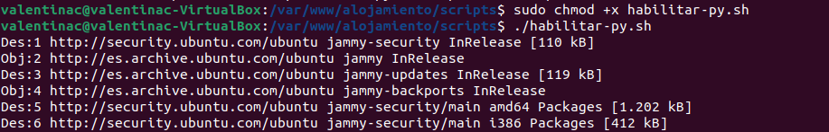


## Crear subdominio

Vamos a crear un subdominio en el servidor DNS con la resolución directa e inversa.


### Crear script

El script lo vamos a crear en el mismo subdirectorio que creamos los anteiores scripts.

```
sudo nano subdominio-dns.sh
```

Dentro colocaremos el siguiente código.

```
#!/bin/bash

#crear_subdominio.sh nombre_subdominio ip
if [ $# -le 1 ];then
   echo Error!. Introduce subdominio e IP!
   exit 1;
fi

# Variables
USER=$1
IP=$2
SUB_DOMAIN="${USER}.alojamiento"
DOCUMENT="/var/www/alojamiento/${USER}"
ZONE_FILE="/etc/bind/db.alojamiento"

echo "Actualizando fichero de zona"
echo "\$ORIGIN ${SUB_DOMAIN}."  >>$ZONE_FILE
echo "@ IN  A   ${IP}"  >>$ZONE_FILE
echo "www   IN  A   ${IP}"  >>$ZONE_FILE

echo "Reiniciar servicios"
service apache2 reload > /dev/null
service bind9 reload > /dev/null
service proftpd reload > /dev/null
```


### Probar script

Para ejecutarlo necesitamos darle permisos de ejecución:

```
chmod +x subdomino-dns.sh
```

Vamos a ejecutar el script nos mostrará el siguiente output.

```
./subdomino-dns.sh nombre-subdominio ip-servidor
```

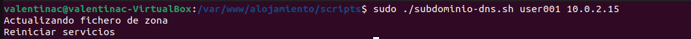


### Comprobar subdominio con dig

Por último vamos a probar que se ha creado el subdominio correctamente.

```
dig nombre-subdominio.alojamiento
```

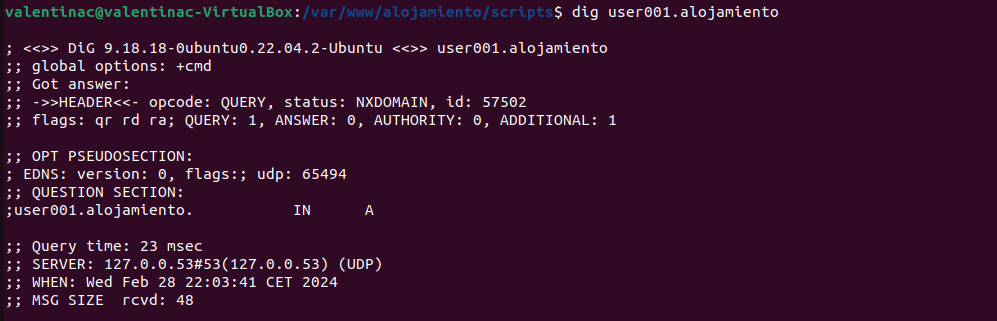

Ahora vamos a probar dig inverso.

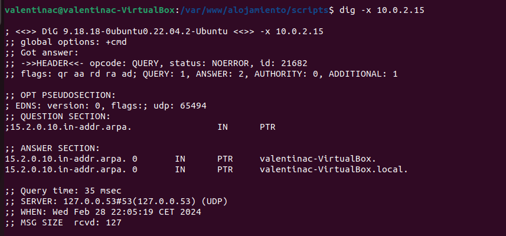