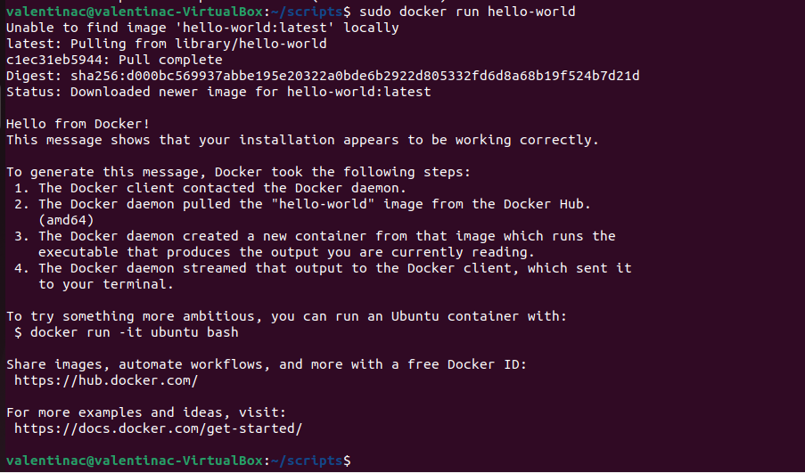
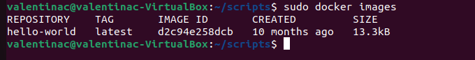
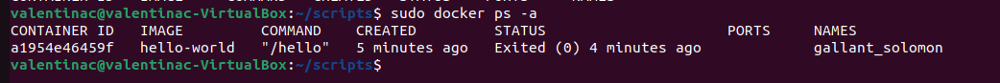

# Introducción a Docker

## Primera parte - Ejecutar la imagen hello-world y mostrar nuestras imágenes y contenedores.

Para empezar vamos a necesitar instalar Docker, pero primero necesitamos eliminar la versión anterior de Docker si es que tenemos.

```
for pkg in docker.io docker-doc docker-compose docker-compose-v2 podman-docker containerd runc; do sudo apt-get remove $pkg; done
```
Bien, ahora necesitamos configurar el repositorio `Docker apt`.
Vamos a crear un script y ejecutarlo.

```
sudo nano docker-apt.sh
```

Dentro introducimos el siguiente código:

```
# Add Docker's official GPG key:
sudo apt-get update
sudo apt-get install ca-certificates curl
sudo install -m 0755 -d /etc/apt/keyrings
sudo curl -fsSL https://download.docker.com/linux/ubuntu/gpg -o /etc/apt/keyrings/docker.asc
sudo chmod a+r /etc/apt/keyrings/docker.asc

# Add the repository to Apt sources:
echo \
  "deb [arch=$(dpkg --print-architecture) signed-by=/etc/apt/keyrings/docker.asc] https://download.docker.com/linux/ubuntu \
  $(. /etc/os-release && echo "$VERSION_CODENAME") stable" | \
  sudo tee /etc/apt/sources.list.d/docker.list > /dev/null
sudo apt-get update
```

Damos permisos para ejecutar el script y lo ejecutamos.

```
sudo chmod +x docker-apt.sh

sudo ./docker-apt.sh
```

Instalamos los paquetes de Docker.

```
sudo apt-get install docker-ce docker-ce-cli containerd.io docker-buildx-plugin docker-compose-plugin
```

Por último, vamos a comprobar que la instalación ha sido exitosa ejecutando la imagen `hello-world`.

```
sudo docker run hello-world
```




### Mostrar nuestras imágenes instaladas.

Para ver las imagenes que tenemos instaladas vamos a usar el siguiente comando:

```
sudo docker images
```




### Mostrar los contenedores.

Para ver los contenedores que tenemos corriendo en Docker vamos a usar el siguiente comando:

```
sudo docker ps
```

Para ver todo el historial de los contenedores vamos a usar el flag `-a`

```
sudo docker ps -a
```

