# Introducción a Docker

## Primera parte - Ejecutar la imagen hello-world y mostrar nuestras imágenes y contenedores.

Para empezar vamos a necesitar instalar Docker, pero primero necesitamos eliminar la versión anterior de Docker si es que tenemos.

```
for pkg in docker.io docker-doc docker-compose docker-compose-v2 podman-docker containerd runc; do sudo apt-get remove $pkg; done
```
Bien, ahora necesitamos configurar el repositorio `Docker apt`.
Vamos a crear un script y ejecutarlo.

```
sudo nano docker-apt.sh
```

Dentro introducimos el siguiente código:

```
# Add Docker's official GPG key:
sudo apt-get update
sudo apt-get install ca-certificates curl
sudo install -m 0755 -d /etc/apt/keyrings
sudo curl -fsSL https://download.docker.com/linux/ubuntu/gpg -o /etc/apt/keyrings/docker.asc
sudo chmod a+r /etc/apt/keyrings/docker.asc

# Add the repository to Apt sources:
echo \
  "deb [arch=$(dpkg --print-architecture) signed-by=/etc/apt/keyrings/docker.asc] https://download.docker.com/linux/ubuntu \
  $(. /etc/os-release && echo "$VERSION_CODENAME") stable" | \
  sudo tee /etc/apt/sources.list.d/docker.list > /dev/null
sudo apt-get update
```

Damos permisos para ejecutar el script y lo ejecutamos.

```
sudo chmod +x docker-apt.sh

sudo ./docker-apt.sh
```

Instalamos los paquetes de Docker.

```
sudo apt-get install docker-ce docker-ce-cli containerd.io docker-buildx-plugin docker-compose-plugin
```

Por último, vamos a comprobar que la instalación ha sido exitosa ejecutando la imagen `hello-world`.

```
sudo docker run hello-world
```


### Mostrar nuestras imágenes instaladas.

Para ver las imagenes que tenemos instaladas vamos a usar el siguiente comando:

```
sudo docker images
```


### Mostrar los contenedores.

Para ver los contenedores que tenemos corriendo en Docker vamos a usar el siguiente comando:

```
sudo docker ps
```

Para ver todo el historial de los contenedores vamos a usar el flag `-a`

```
sudo docker ps -a
```


---

## Segunda parte - Editar Dockerfile y publicar el contenedor en Docker Hub.

Vamos a clonar una aplicación todo list simple manejada por Node.js.

Para ello vamos a necesitar tener instalado git.

```
sudo apt-get install git
```

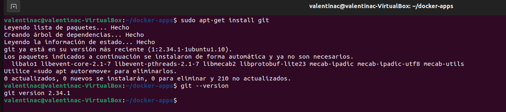


### Obtener la app

Ahora que tenemos la git vamos a clonar la app.

```
sudo git clone https://github.com/docker/getting-started-app.git
```

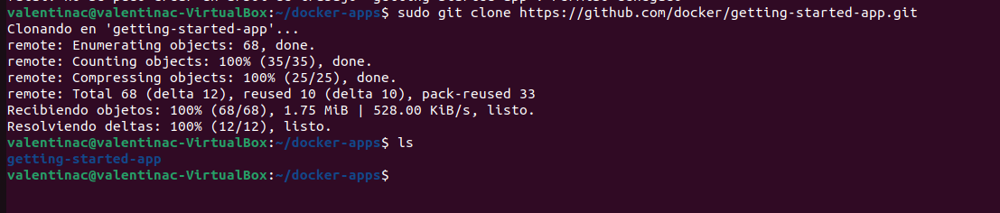

Si vemos la estructura de carpetas que se ha creado, veremos algo así:

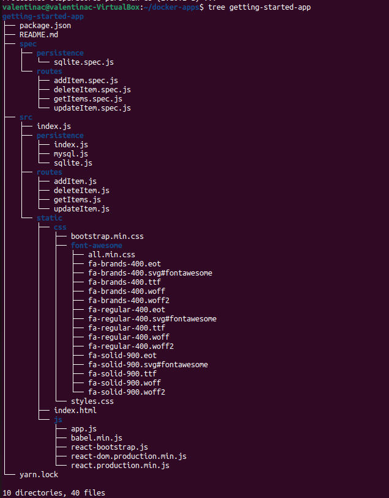


### Crear la imagen de la app

Primero y lo más importante vamos a ir al directorio donde queremos tener nuestra app.

```
cd /home/valentin/docker-apps
```

Ahora vamos a crear el fichero Dockerfile.

```
sudo nano Dockerfile
```

Dentro colocamos el siguiente código:

```
# syntax=docker/dockerfile:1

FROM node:18-alpine
WORKDIR /app
COPY . .
RUN yarn install --production
CMD ["node", "src/index.js"]
EXPOSE 3000
```


### Construir la imagen

Para construir la imagen de nuestra app vamos a ejecutar el siguiente comando:

```
sudo docker build -t getting-started .
```

El flag `-t` sirve para darle un tag(etiqueta para reconocer la imagen).
Al final con `.` indicamos el directorio donde debe buscar el Dockerfile, en este caso en este mismo directorio.

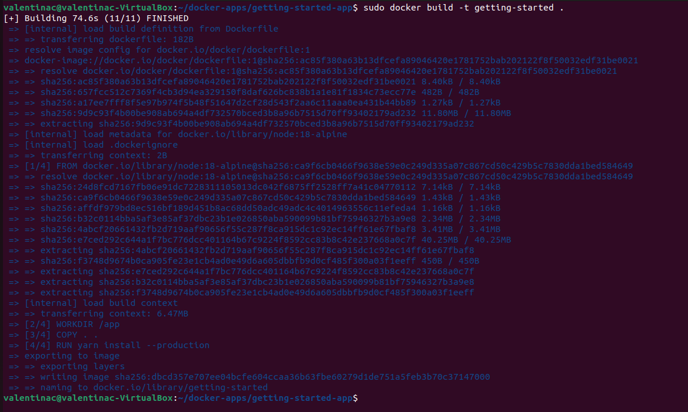


### Iniciar el contenedor

Ahora que tenemos nuestra imagen vamos a ejecutar el comando `docker run` para inciar el contenedor.
Tenemos que indicarle la imagen que queremos usar para crear el contenedor.

```
sudo docker run -dp 127.0.0.1:3000:3000 getting-started
```

La flag `-d` sirve para ejecutar en contenedor de fondo. Podemos verficar que se ha iniciado correctamente con el comando ``` sudo docker ps ```
La flag `-p` sirve para mapear los puertos del host y contenedor. `HOST:CONTAINER`. Luego podremos visualizar nuestra app corriendo en `localhost:3000`.

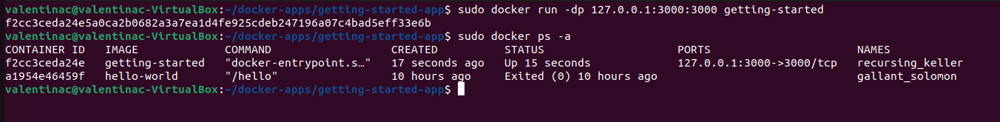


### Probar la app

Para probar la app vamos a ir al navegador y ponermos `localhost:3000`.

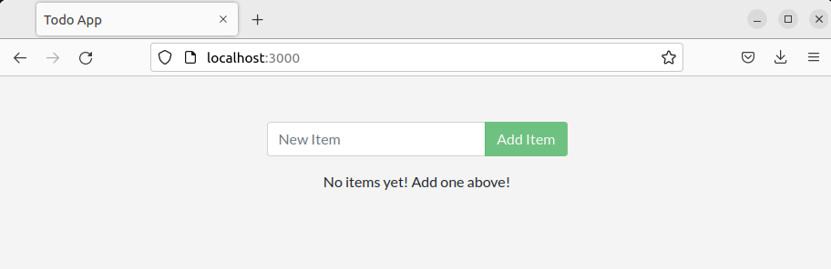


### Publicar la imagen a Docker Hub

Para publicar nuestra imagen primero debemos tener una cuenta en Docker Hub, [Crear cuenta en Docker Hub](https://hub.docker.com)

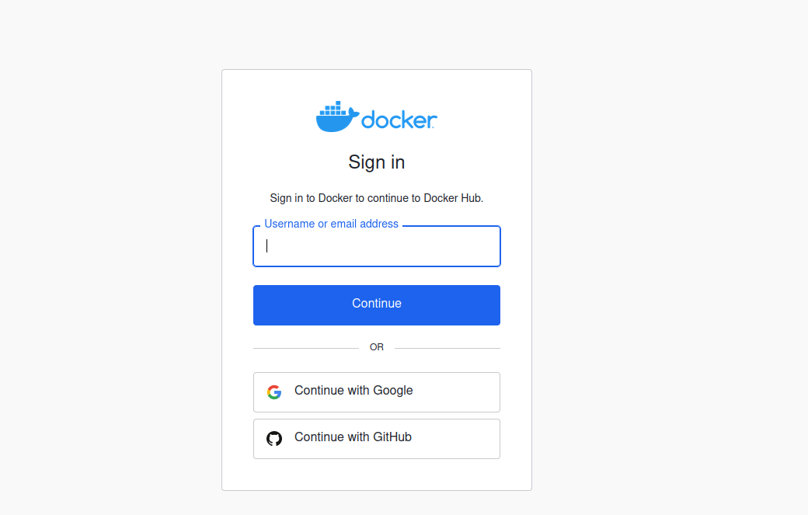

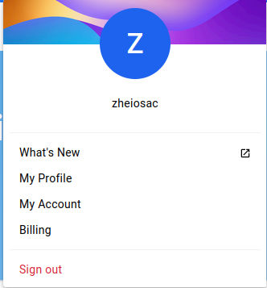

Ahora en la terminal vamos a tener que iniciar sesión.

```
sudo docker login -u TU-USUARIO
```

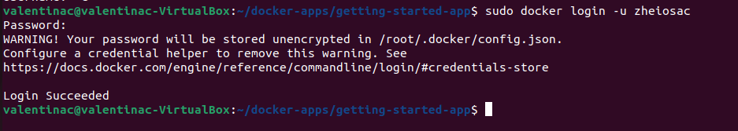

Luego tenemos que identificar nuestra imagen con un tag.

```
sudo docker tag getting-started TU-USUARIO/getting-started
```

Por último, vamos a hacer un `docker push`.

```
sudo docker push TU-USUARIO/getting-started
```

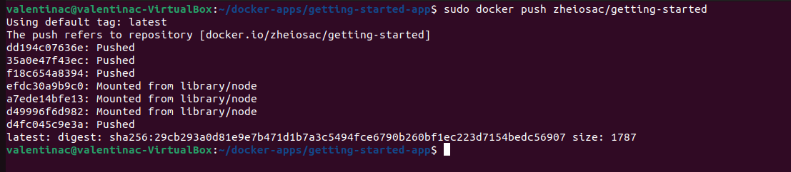

Podemos comprobar que nuestra imagen se ha publicado exitosamente visitando nuestro Docker Hub.

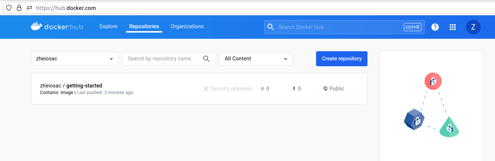