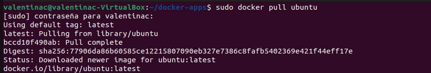
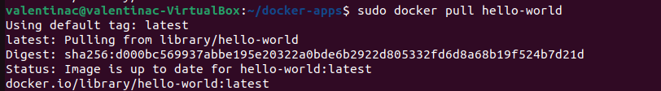
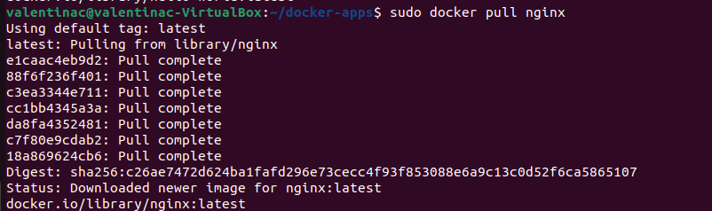
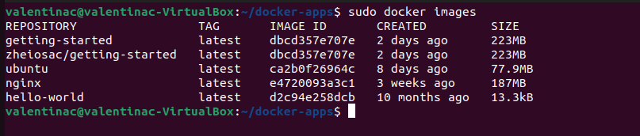
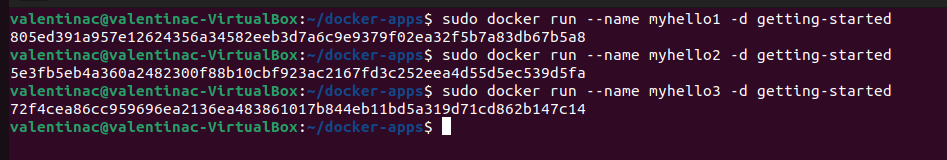
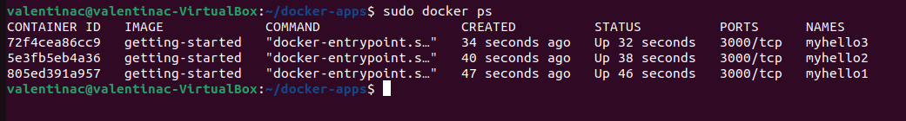
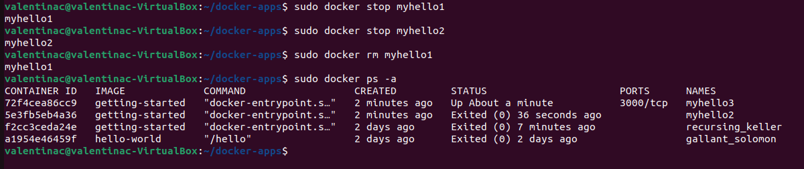
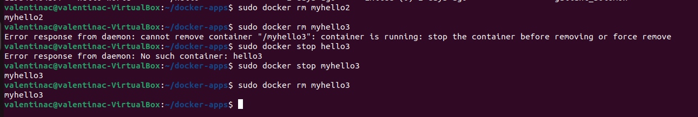

# Práctica 3. Docker

## Descarga imagenes

Para esta práctica vamos a descargar las siguiente imagenes:

**Ubuntu**

```
sudo docker pull ubuntu
```



**Hello-world**

```
sudo docker pull hello-world
```



**Nginx**

```
sudo docker pull nginx
```



## Mostrar todas las imagenes

Para mostrar todas las imágenes que tenemos instaladas vamos a usar el siguiente comando:

```
sudo docker images
```




## Ejecutar contenedores

Vamos a crear y ejecutar 3 contenedores con la imagen `getting-started` debido a que la imagen `hello-world` solo devuelve un mensaje de bienvenida y se para solo, necesitamos que se muestren los contenedores corriendo.

Para crear los contenedores vamos a usar el comando `docker run`, este crea e inicia directamente el contenedor.

```
sudo docker run --name myhello1 -d getting-started

sudo docker run --name myhello1 -d getting-started

sudo docker run --name myhello1 -d getting-started
```




## Muestra los contendores que se están ejecutando

Para ver los contendores que se están ejecutando vamos a usar el comando `docker ps`




## Parar y borrar contendores

Vamos a parar los contendores `myhello1` y `myhello2`, eliminar `myhello1` y por último mostrar los contendores que se están ejecutando.

Primero vamos a parar los contenedores.

```
sudo docker stop myhello1

sudo docker stop myhello2
```

A continuación eliminamos el contenedor.

```
sudo docker rm myhello1
```

Por último, mostramos el historial de contendores con `ps -a` para poder ver que ya no hay ningún contenedor `myhello1`, además que el único que sigue ejecutandose es `myhello3`.




## Eliminar todos los contenedores

Para elimar los contendores primero necesitamos pararlos, si no, nos daré una excepción.

```
sudo docker rm myhello2

sudo docker stop myhello3

sudo docker rm myhello3
```

