# Práctica 4. Almacenamiento y redes en Docker

## Ejemplo 1. Despliegue de la aplicación Guestbook.

Vamos a desplegar una aplicación, para ello necesitamos de 2 servicios:

- La aplicación guestbook es una aplicación web desarrollada en python que es servida por el puerto 5000/tcp. Utilizaremos la imagen `iesgn/guestbook`.
- Esta aplicación guarda la información en una base de datos no relacional redis, que utiliza el puerto 6379/tcp para conectarnos. Usaremos la imagen `redis`.

### Volúmenes

Para que la información sea persistente vamos a necesitar un volúmen para guardar la información de la base de datos.

Si estudiamos la documentación de la imagen redis en Docker Hub, para que la información de la base de datos se guarde en un directorio `/data` del contenedor hay que ejecutar el proceso `redis-server` con los argumentos `--appendonly yes`.

### Redes

La aplicación guestbook por defecto utiliza el nombre `redis` para conectarse a la base de datos, por lo tanto debemos nombrar al contenedor redis con ese nombre para que tengamos una resolución de nombres adecuada.

Los dos contenedores tienen que estar en la misma red y deben tener acceso por nombres (resolución DNS) ya que de principio no sabemos que ip va a coger cada contenedor. Por lo tanto vamos a crear los contenedores en la misma red:

```
sudo docker network create red_guestbook
```

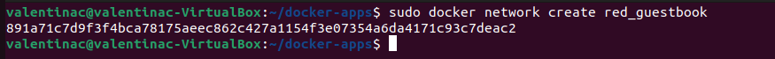


Para ejecutar los contenedores:

```
sudo docker run -d --name redis --network red_guestbook -v /opt/redis:/data redis redis-server --appendonly yes

sudo docker run -d -p 80:5000 --name guestbook --network red_guestbook iesgn/guestbook
```

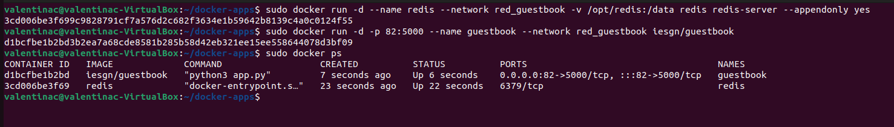

Ahora que tenemos los contenedores listos vamos a ver la aplicación corriendo.

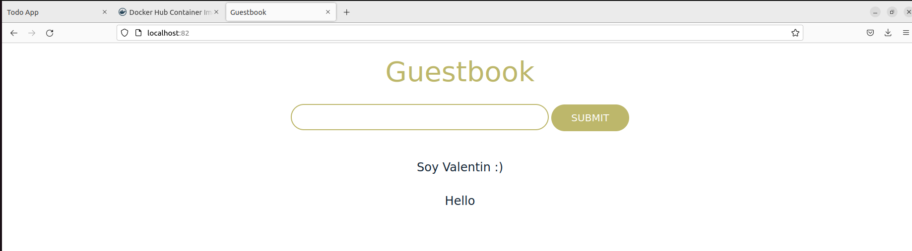


### Configuración de la aplicación

En la creación de la imagen `iesgn/guestbook` se ha creado una variable de entorno (llamada `REDIS_SERVER`) donde se configura el nombre del servidor de base de datos redis al que se accede, por defecto el valor de esta variable es `redis`. Por lo tanto, es necesario que el contenedor de la base de datos tenga el nombre redis para que el contenedor de guestbook pueda conectar a la base de datos.

Si creamos un contenedor redis con otro nombre, por ejemplo:

```
sudo docker run -d --name contenedor_redis --network red_guestbook -v /opt/redis:/data redis redis-server --appendonly yes
```

Tendremos que configurar la aplicación guestbook parea que acceda a la base de datos redis usando como nombre `contenedor_redis`, por lo tanto en la creación tendremos que definir la variable de entorno `REDIS_SERVER`, para ello ejecutamos:

```
sudo docker run -d -p 80:5000 --name guestbook -e REDIS_SERVER=contenedor_redis --network red_guestbook iesgn/guestbook
```

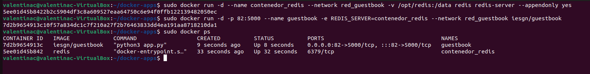

Si volvemos a ver la aplicación veremos que sigue funcionando correctamente.

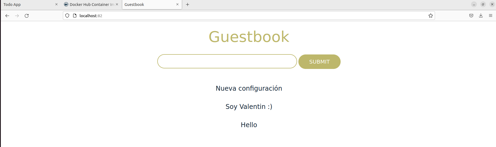


## Ejemplo 2. Despliegue de la aplicación Temperaturas.

Vamos a hacer un despliegue completo de una aplicación llamada Temperaturas. Esta aplicación nos permite consultar la temperatura mínima y máxima de todos los municipios de España. Esta aplicación está formada por dos microservicios:

- **frontend**: Es una aplicación escrita en Python que nos ofrece una página web para hacer las búsquedas y visualizar los resultados. Este microservicio hará peticiones HTTP al segundo microservicio para obtener la información. Este microservicio ofrece el servicio en el puerto 3000/tcp. Usaremos la imagen `iesgn/temperaturas_frontend`.
- **backend**: Es el segundo microservicio que nos ofrece un servicio web de tipo API Restful. A esta API Web podemos hacerles consultas sobre los municipios y sobre las temperaturas. En este caso, se utiliza el puerto 5000/tcp para ofrecer el servicio. Usaremos la imagen `iesgn/temperaturas_backend`.

El microservicio frontend se conecta a backend usando el nombre `temperaturas-backend`. Por lo tanto el contenedor con el micorservicio backend tendrá ese nombre para disponer de una resolución de nombres adecuada en el dns.

Vamos a crear una red para conectar los dos contenedores:

```
sudo docker network create red_temperaturas
```

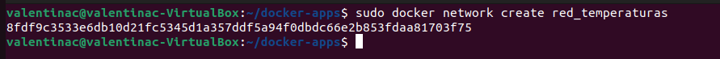

Para ejecutar los contendores:

```
sudo docker run -d --name temperaturas-backend --network red_temperaturas iesgn/temperaturas_backend

sudo docker run -d -p 80:3000 --name temperaturas-frontend --network red_temperaturas iesgn/temperaturas_frontend
```

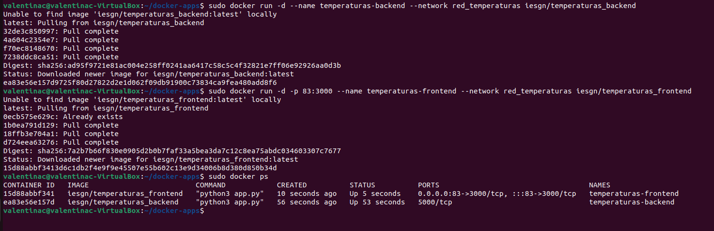

Ahora que tenemos los contenedores listos vamos a ver la aplicación corriendo.

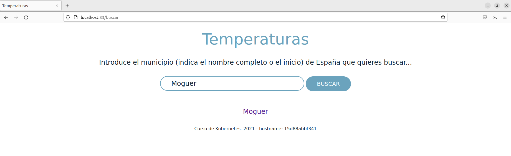


### Configuración de la aplicación.

En la creación de la imagen `iesgn/temperaturas_frontend` se ha creado una variable de entorno (llamada `TEMP_SERVER`) donde se configura el nombre del servidor y el puerto de acceso del microservicio `frontend` y que debe corresponder con el nombre y el puerto del microservicio `backend`. Por defecto esta variable tiene como valor `temperaturas-backend:5000`, por lo tanto, es necesario que el contenedor del backend se llame `temperaturas-backend` y debe ofrecer el servicio en el puerto `5000`.

Si creamos otro contendor `backend` con otro nombre, por ejemplo:

```
sudo docker run -d --name temperaturas-api --network red_temperaturas iesgn/temperaturas_backend
```

Tendremos que configurar la aplicación `frontend` parea que acceda al `backend` usando como nombre `temperaturas-api`, por lo tanto en la creación tendremos que definir la variable de entorno `TEMP_SERVER`, para ello ejecutamos:

```
sudo docker run -d -p 80:3000 --name temperaturas-frontend -e TEMP_SERVER=temperaturas-api:5000 --network red_temperaturas iesgn/temperaturas_frontend
```

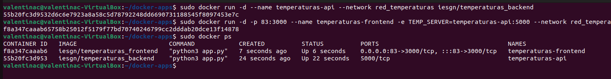

Si volvemos a ver la aplicación veremos que sigue funcionando correctamente.

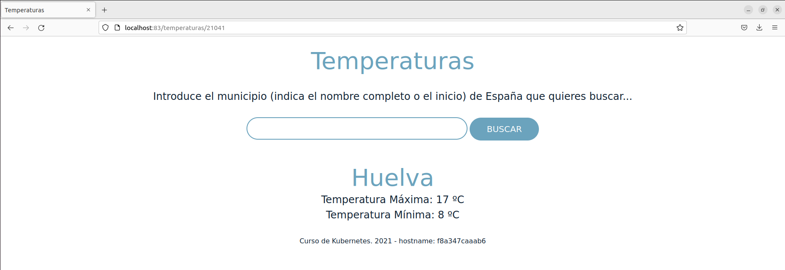


## Ejemplo 3. Despliegue de Wordpress + mariadb

Para la instalación de Wordpress necesitamos 2 contenedores:

- La base de datos (imagen `mariadb`).
- El servidor web con la aplicación (imagen `wordpress`).

Ambos contenedores necesitan estar en la misma red.

```
sudo docker network create red_wp
```

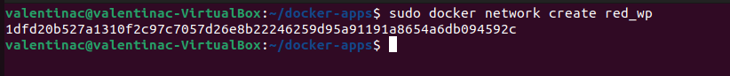

A continuación necesitamos crear los contenedores con sus respectivas variables de entorno, para ello vamos a seguir la documentación de cada imagen.

```
sudo docker run -d --name servidor_mysql \
                --network red_wp \
                -v /opt/mysql_wp:/var/lib/mysql \
                -e MYSQL_DATABASE=bd_wp \
                -e MYSQL_USER=user_wp \
                -e MYSQL_PASSWORD=asdasd \
                -e MYSQL_ROOT_PASSWORD=asdasd \
                mariadb
                
sudo docker run -d --name servidor_wp \
                --network red_wp \
                -v /opt/wordpress:/var/www/html/wp-content \
                -e WORDPRESS_DB_HOST=servidor_mysql \
                -e WORDPRESS_DB_USER=user_wp \
                -e WORDPRESS_DB_PASSWORD=asdasd \
                -e WORDPRESS_DB_NAME=bd_wp \
                -p 80:80 \
                wordpress
```

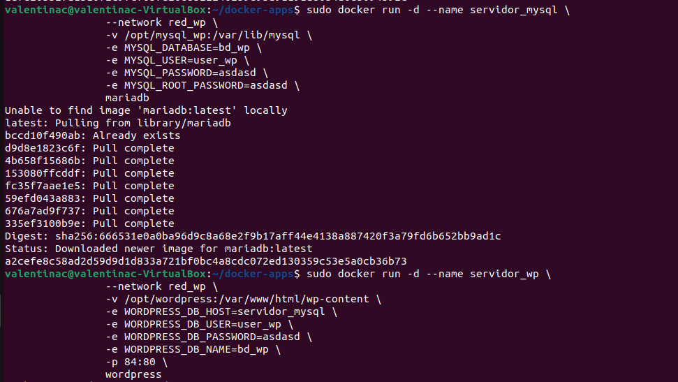

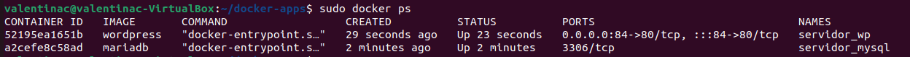

Ahora que tenemos los contenedores listos vamos a ver la aplicación corriendo.

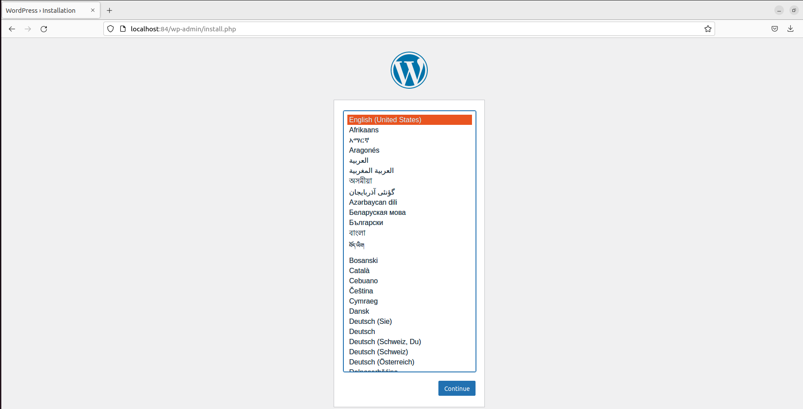