# Práctica 5. Creando escenarios multicontenedor con Docker Compose.

## Ejemplo 1. Despliegue de la aplicación Guestbook.

En este ejemplo vamos a desplegar con Docker Compose la aplicación **guestbook**.

Para ello vamos a crear un fichero `docker-compose.yml` donde vamos a definir nuestro escenario.

```
sudo nano docker-compose.yml
```

Dentro del fichero vamos a pegar el siguiente código:

```yaml
version: '3.1'
services:
  app:
    container_name: guestbook
    image: iesgn/guestbook
    restart: always
    environment:
      REDIS_SERVER: redis
    ports:
      - 8080:5000
  db:
    container_name: redis
    image: redis
    restart: always
    command: redis-server --appendonly yes
    volumes:
      - redis:/data
volumes:
  redis:
```

Veamos algunas observaciones:

- Aunque ya sabemos que la variable de entorno `REDIS_SERVER` tiene el valor `redis` por defecto, la hemos indicado indicando el nombre del contenedor redis.
- Podríamos haber usado también el nombre del servicio, es decir, `REDIS_SERVER: db`, ya que, como hemos comentado, la resolución se puede hacer usando el nombre del contenedor o el nombre del servicio.
- Como vimos en el ejemplo del módulo 3, al crear el contenedor tenemos que ejecutar el comando `redis-server --appendonly yes` para que redis guarde la información de la base de datos en el directorio `/datos`. Para indicar el comando que hay que ejecutar al crear el contenedor usamos el parámetro `command`.
- Por último indicar que hemos uso un volumen docker llamado `redis` para guardar la información de la base de datos (en el módulo3 usamos un bind mount).

Para crear el escenario:

```
sudo docker compose up -d
```

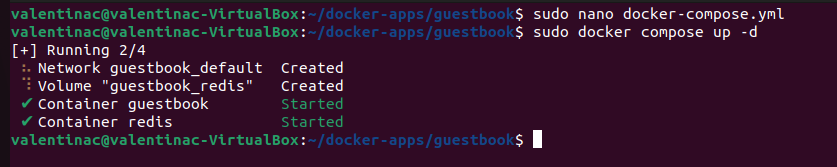

Para mostrar los contenedores:

```
sudo docker ps
```

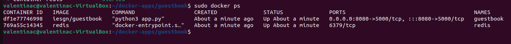

Podremos comprobar que la aplicación funciona corerctamente si vamos a `localhost:8080`.

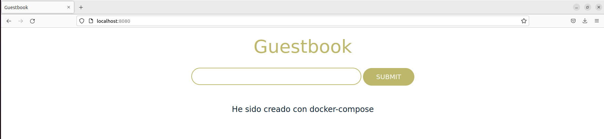

Para parar los contenedores:

```
sudo docker down
```

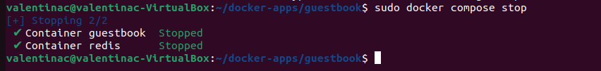

Para eliminar el escenario:

```
sudo docker down
```

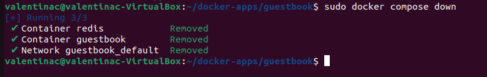

Para eliminar también el volumen podemos usar `docker compose down -v`.


## Ejemplo 2. Despliegue de la aplicación Temperaturas.

En este ejemplo vamos a desplegar con Docker Compose la aplicación Temperaturas.

Vamos a crear el fichero `docker-compose.yml`.

```
sudo nano docker-compose.yml
```

Dentro del fichero copiamos el siguiente código:

```yaml
version: '3.1'
services:
  frontend:
    container_name: temperaturas-frontend
    image: iesgn/temperaturas_frontend
    restart: always
    ports:
      - 8081:3000
    environment:
      TEMP_SERVER: temperaturas-backend:5000
    depends_on:
      - backend
  backend:
    container_name: temperaturas-backend
    image: iesgn/temperaturas_backend
    restart: always
```

Como hicimos en el ejemplo anterior, aunque no es necesario porque es valor por defecto, declaramos la variable de entorno `TEMP_SERVER`: `temperaturas-backend:5000`. Como indicábamos también, podríamos uso del nombre del servicio, de esta manera quedaría como `TTEMP_SERVER`: `backend:5000`.

Para crear el escenario:

```
sudo docker compose up -d
```

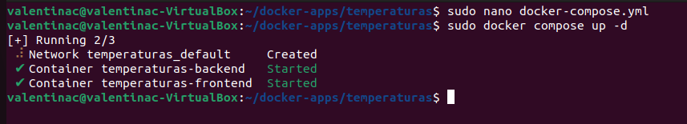

Para mostrar los contenedores:

```
sudo docker ps
```

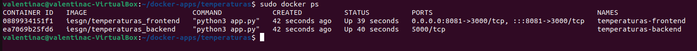

Podremos comprobar que la aplicación funciona corerctamente si vamos a `localhost:8081`.

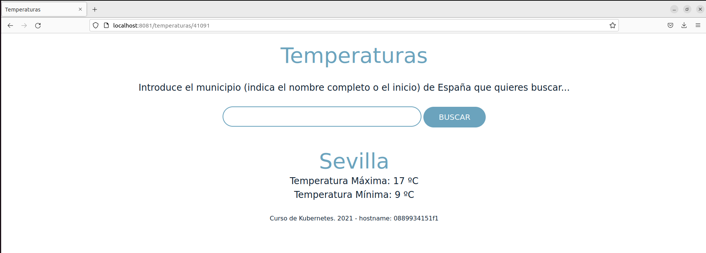


## Ejemplo 3. Despliegue de WordPress + Mariadb.

En este ejemplo vamos a desplegar con Docker Compose la aplicación WordPress + MariaDB.


### Utilizando volúmenes docker.

Por ejemplo para la ejecución de wordpress persistente con volúmenes docker podríamos tener un fichero docker-compose.yaml con el siguiente contenido:

```yaml
version: '3.1'
services:
  wordpress:
    container_name: servidor_wp
    image: wordpress
    restart: always
    environment:
      WORDPRESS_DB_HOST: db
      WORDPRESS_DB_USER: user_wp
      WORDPRESS_DB_PASSWORD: asdasd
      WORDPRESS_DB_NAME: bd_wp
    ports:
      - 80:80
    volumes:
      - wordpress_data:/var/www/html/wp-content
  db:
    container_name: servidor_mysql
    image: mariadb
    restart: always
    environment:
      MYSQL_DATABASE: bd_wp
      MYSQL_USER: user_wp
      MYSQL_PASSWORD: asdasd
      MYSQL_ROOT_PASSWORD: asdasd
    volumes:
      - mariadb_data:/var/lib/mysql
volumes:
    wordpress_data:
    mariadb_data:
```

Para crear el escenario:

```
sudo docker compose up -d
```

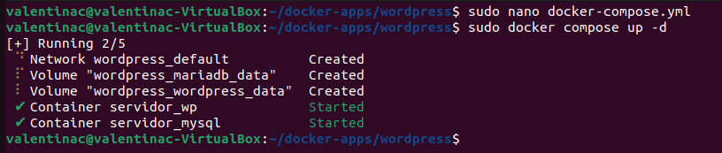

Para mostrar los contenedores:

```
sudo docker ps
```

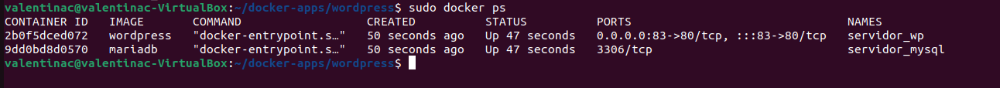

Podremos comprobar que la aplicación funciona corerctamente si vamos a `localhost:80`.

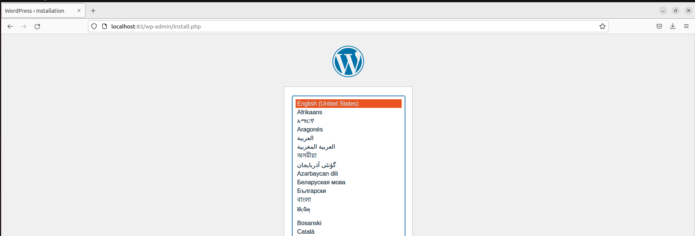

Para parar y eliminar directamente todo el escenario, red y volúmenes incluidos:

```
sudo docker compose down -v
```

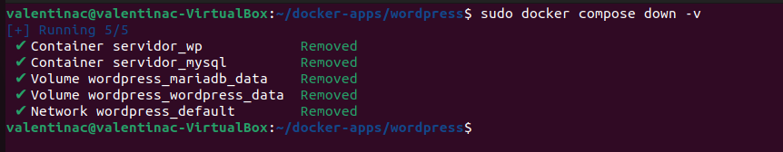


### Utilizando bind-mount.

Por ejemplo para la ejecución de wordpress persistente con bind mount podríamos tener un fichero docker-compose.yaml con el siguiente contenido:

```yaml
version: '3.1'
services:
  wordpress:
    container_name: servidor_wp
    image: wordpress
    restart: always
    environment:
      WORDPRESS_DB_HOST: db
      WORDPRESS_DB_USER: user_wp
      WORDPRESS_DB_PASSWORD: asdasd
      WORDPRESS_DB_NAME: bd_wp
    ports:
      - 80:80
    volumes:
      - ./wordpress:/var/www/html/wp-content
  db:
    container_name: servidor_mysql
    image: mariadb
    restart: always
    environment:
      MYSQL_DATABASE: bd_wp
      MYSQL_USER: user_wp
      MYSQL_PASSWORD: asdasd
      MYSQL_ROOT_PASSWORD: asdasd
    volumes:
      - ./mysql:/var/lib/mysql
```